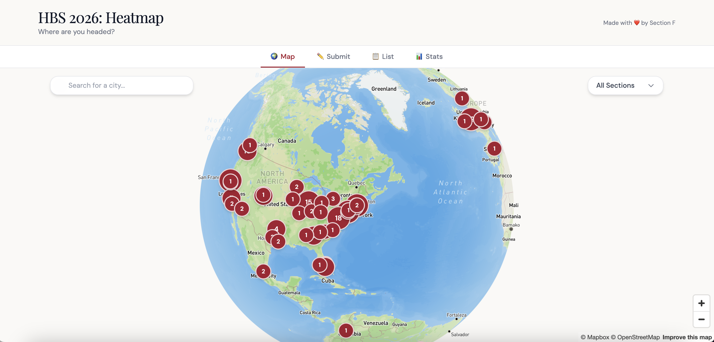
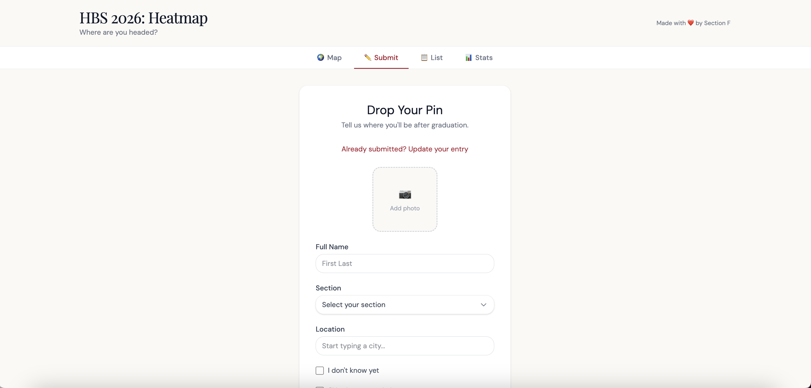
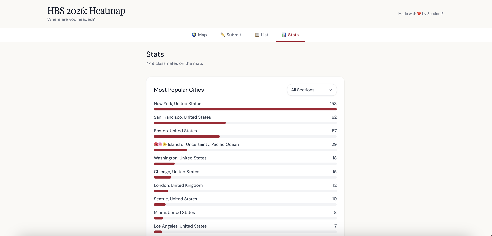

# class-map

A self-serve map for any school or class to drop pins of where everyone's headed. Fork it, edit one config file, deploy.

[](https://vercel.com/new/clone?repository-url=https%3A%2F%2Fgithub.com%2Fmbcrosiersamuel%2Fclass-map&env=VITE_MAPBOX_TOKEN,VITE_SUPABASE_URL,VITE_SUPABASE_ANON_KEY&envDescription=See%20the%20README%20for%20how%20to%20get%20these&envLink=https%3A%2F%2Fgithub.com%2Fmbcrosiersamuel%2Fclass-map%23quick-start-15-minutes&project-name=class-map&repository-name=class-map)
[](https://app.netlify.com/start/deploy?repository=https://github.com/mbcrosiersamuel/class-map)



| Submit | Stats |
|---|---|
|  |  |

**Features**
- 🌍 Interactive globe with pins clustered by city
- ✏️ Anyone can submit themselves with a photo, location(s), and a group (Section / Team / Cohort — your call)
- 📋 List view with name/group/city/country filters
- 📊 Stats view with most-popular cities and group participation
- 🌺 Optional "Island of Uncertainty" pin for people who don't know yet
- 🔁 Realtime — new pins show up live for everyone

**Tech**: React + Vite + Tailwind v4 + Mapbox GL + Supabase. ~2k lines, fully client-side.

---

## ⚠️ Important: there is no authentication

**Anyone with the link can add, edit, or move *any* entry — including yours.** Anyone can also re-upload a photo for anyone. There is no login.

This is intentional and works fine for a small trusted class group, but **do not deploy this publicly without thinking about it**. If you want real auth, you'll need to wire up Supabase Auth and adjust the RLS policies in `supabase/schema.sql` — see [Adding auth](#adding-auth) below for pointers.

---

## Quick start (~15 minutes)

You'll need:
- A free [GitHub](https://github.com) account
- A free [Mapbox](https://account.mapbox.com/auth/signup/) account (50k map loads/month free)
- A free [Supabase](https://supabase.com) account
- A free [Vercel](https://vercel.com) **or** [Netlify](https://www.netlify.com) account

### 1. Fork this repo

Click the green **Use this template** button at the top of this repo on GitHub (or fork it). Pick a name like `your-school-map`.

### 2. Set up Mapbox

1. Sign up / log in at https://account.mapbox.com/
2. Go to https://account.mapbox.com/access-tokens/
3. Copy the **Default public token** (starts with `pk.`). Keep this tab open — you'll paste it into Vercel/Netlify in step 5.

### 3. Set up Supabase

1. Sign up / log in at https://supabase.com/dashboard
2. Click **New project**. Pick any name, set a database password (save it somewhere — but the app doesn't need it), choose a region near your users. Wait ~2 minutes for the project to provision.
3. In the left sidebar, click **SQL Editor** → **New query**.
4. Open `supabase/schema.sql` from this repo, copy its **entire contents**, paste into the SQL Editor, and click **Run**. You should see "Success. No rows returned."
5. In the left sidebar, click **Settings** (gear icon) → **API**.
6. Copy two values into a notes app — you'll need them in step 5:
   - **Project URL** (looks like `https://xxxxx.supabase.co`)
   - **`anon` `public` API key** (a long string under "Project API keys")

### 4. Configure your school

Edit `src/config.ts` in your fork. Set at minimum:
```ts
schoolName: 'Your School',
classYear: '2030',
primaryColor: '#1F4E79',         // your school's color (hex)
credit: { text: '...', href: '...' },
grouping: {
  enabled: true,
  label: 'Section',              // or 'Team', 'Cohort', 'House'...
  values: ['A', 'B', 'C', 'D'],  // your group names
},
```

Commit and push. (See [Customizing](#customizing) for everything else you can change.)

### 5. Deploy

Pick **one** of:

#### Option A: Vercel (recommended)

1. Go to https://vercel.com/new
2. Import your fork.
3. Vercel auto-detects Vite. Before clicking Deploy, expand **Environment Variables** and add three:

   | Name | Value |
   |---|---|
   | `VITE_MAPBOX_TOKEN` | Your Mapbox `pk.…` token from step 2 |
   | `VITE_SUPABASE_URL` | Your Supabase project URL from step 3 |
   | `VITE_SUPABASE_ANON_KEY` | Your Supabase `anon` public key from step 3 |

4. Click **Deploy**. ~1 minute later you have a live URL.

#### Option B: Netlify

1. Go to https://app.netlify.com/start
2. Connect your GitHub fork.
3. Netlify auto-detects the build command (`npm run build`) and publish directory (`dist`).
4. Before deploying, click **Show advanced** → **New variable** and add the three env vars from the table above.
5. Click **Deploy site**.

### 6. Drop your pin

Open your live URL, click **✏️ Submit**, and add yourself. Realtime is on, so every other viewer will see the new pin instantly.

---

## Customizing

Everything brand-related lives in **`src/config.ts`**. Edit it, commit, push, and your deploy redeploys automatically.

```ts
// Identity — shown in the page title, header, and social previews
schoolName: 'Your School',
classYear: '2030',
tagline: 'Class Map',
subtitle: 'Where are you headed?',
credit: {
  text: 'Powered by class-map',
  href: 'https://github.com/mbcrosiersamuel/class-map',  // change to your fork
},

// Theme — applied everywhere via CSS variables
primaryColor: '#A51C30',          // accent color (buttons, pins, links)
backgroundColor: '#FAF9F6',       // page background
logoSrc: '/logo.svg',             // optional; put a file in /public and point here

// Map — initial center and zoom
defaultCenter: { latitude: 42.37, longitude: -71.11 },
defaultZoom: 2,

// Grouping — sections, teams, cohorts, houses, etc.
grouping: {
  enabled: true,                  // false → hides the grouping UI everywhere
  label: 'Section',               // singular noun — also drives plural ("Sections")
  values: ['A', 'B', 'C'],        // pickable values
},

// Island of Uncertainty — fictional pin for "I don't know yet"
uncertainty: {
  enabled: true,                  // false → hides the "I don't know yet" checkbox
  label: 'Island of Uncertainty',
  country: 'Pacific Ocean',
  coords: { latitude: 5.0, longitude: -170.0 },
},
```

### Common customizations

**Disable grouping entirely (just one big map of everyone):**
```ts
grouping: { enabled: false, label: 'Section', values: [] },
```

**Use teams or houses instead of sections:**
```ts
grouping: {
  enabled: true,
  label: 'House',
  values: ['Gryffindor', 'Ravenclaw', 'Hufflepuff', 'Slytherin'],
},
```

**Center the map on a different place** (e.g. London):
```ts
defaultCenter: { latitude: 51.5, longitude: -0.13 },
defaultZoom: 4,
```

**Replace the OG image** for nice social link previews: drop a 1200×630 PNG named `og-image.png` into `public/`, then update `index.html` to reference it.

**Replace the favicon**: drop a new `favicon.svg` into `public/`.

---

## Local development

```bash
npm install
cp .env.example .env             # then fill in your three keys
npm run dev                      # http://localhost:5173
```

Build for production:
```bash
npm run build
npm run preview                  # preview the dist build locally
```

---

## Adding auth

Out of the box, anyone with the link can edit any entry. To add real authentication:

1. Enable an auth provider in **Authentication → Providers** in your Supabase dashboard (email magic link is easiest).
2. Tighten the RLS policies in `supabase/schema.sql`. The current policies use `using (true)` and `with check (true)`. Replace with checks against `auth.uid()`, e.g.:
   ```sql
   create policy "users can update their own row"
     on public.people for update
     using (auth.uid() = owner_id);
   ```
   You'll need to add an `owner_id uuid references auth.users(id)` column to the `people` table.
3. Add a sign-in screen to the React app. The Supabase client is already wired up in `src/lib/supabase.ts`.

This is left as a fork-time exercise — every school's auth needs are different.

---

## Project structure

```
class-map/
├── public/
│   ├── favicon.svg              # replace with your school's icon
│   └── og-image.svg             # replace with your social preview
├── src/
│   ├── config.ts                # ← edit this to brand the app
│   ├── App.tsx                  # tab routing
│   ├── main.tsx                 # entry; applies theme from config
│   ├── index.css                # Tailwind + theme tokens
│   ├── components/
│   │   ├── layout/              # Header, TabBar
│   │   ├── map/                 # MapView, GroupFilter, MapSearchBar, etc.
│   │   ├── list/                # ListView, ListFilters, PersonRow
│   │   ├── stats/               # StatsView
│   │   ├── submit/              # SubmitForm, PhotoUpload, LocationAutocomplete
│   │   └── ui/                  # Dropdown
│   ├── hooks/usePeople.ts       # Supabase fetch + realtime listener
│   ├── lib/
│   │   ├── supabase.ts          # Supabase client
│   │   ├── geocode.ts           # Mapbox geocoding wrapper
│   │   └── constants.ts         # values derived from config.ts
│   └── types/index.ts
└── supabase/
    └── schema.sql               # paste into Supabase SQL Editor
```

---

## License

MIT — see [LICENSE](./LICENSE).
